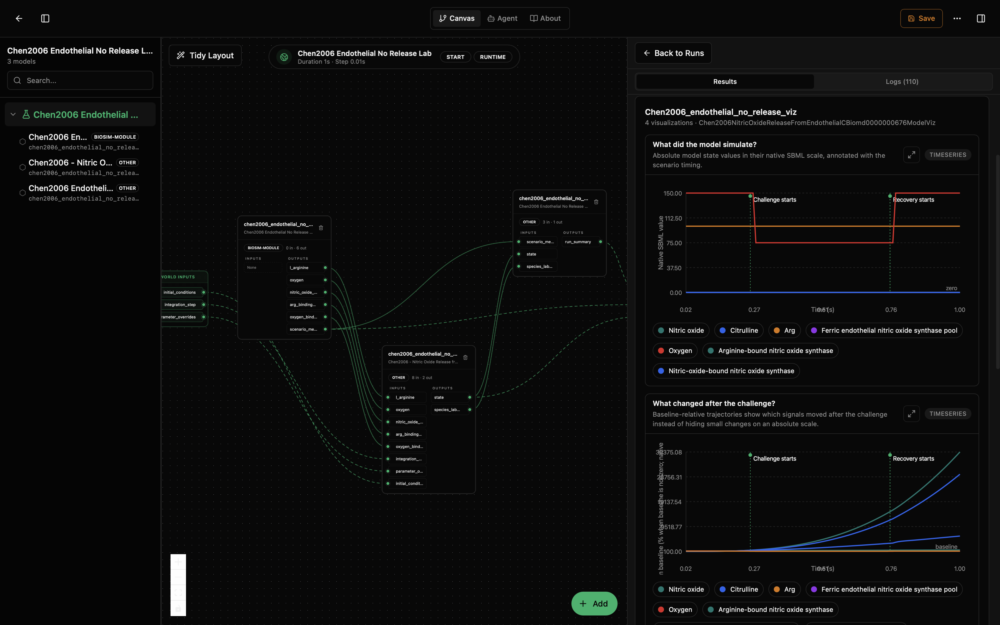
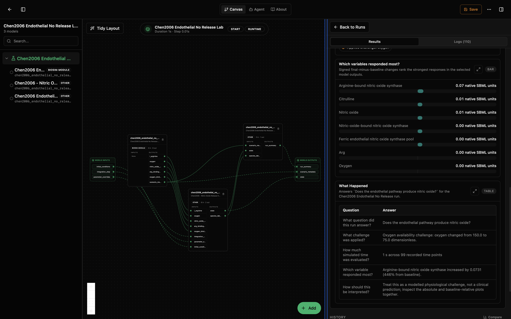

# Chen2006 Endothelial No Release Lab

This lab asks: **Does the endothelial pathway produce nitric oxide?**

The lab is composed of three sub-models: a `scenario` driver, a `core` SBML simulator solved by Tellurium, and a dedicated `viz` presenter that turns the raw simulation state into annotated timeseries, ranked response bars, and a plain-language "What Happened" summary. The split keeps the upstream SBML wrapper clean while making the oxygen challenge and interpretation layer explicit.

The core model is Chen2006, *Nitric Oxide Release from Endothelial Cells*, BioModels `BIOMD0000000676`, described in the article "Theoretical analysis of biochemical pathways of nitric oxide release from vascular endothelial cells." The bundled scenario asks how the pathway responds when oxygen availability is temporarily reduced.

## What You'll See

The lab opens as a canvas with three model nodes wired in series: the scenario driver on the left, the core simulator in the middle, and the visualization sub-model on the right. The default scenario runs for 1 s at a 0.01 s communication step. It holds oxygen at 150 during baseline, drops oxygen to 75 from 0.25 s to 0.75 s, then restores oxygen to 150 for recovery.

After running, the viz node emits four visualizations: an event-annotated absolute timeseries, a baseline-relative response timeseries, a signed response bar chart, and a question-and-answer table titled `What Happened` that answers `Does the endothelial pathway produce nitric oxide?` in plain language. The viz node also publishes the table as a structured `run_summary` record that downstream nodes can consume.

**Primary variables shown:** the core publishes a curated state record for the visualization, and the viz node presents these concepts with user-friendly labels:

- Arg
- Ferric endothelial nitric oxide synthase pool
- Arginine-bound nitric oxide synthase
- Reduced enzyme pool
- Reduced arginine-bound enzyme
- Nitric-oxide-bound nitric oxide synthase
- Nitric oxide
- Reduced nitric-oxide-bound enzyme
- Hydroxyarginine-bound nitric oxide synthase
- Hydroxyarginine
- Reduced hydroxyarginine-bound enzyme
- Oxygen
- Oxygen-and-arginine-bound nitric oxide synthase
- Oxygen-and-hydroxyarginine-bound nitric oxide synthase
- Citrulline

The first results screen shows the absolute SBML-scale trajectories above a baseline-relative view. The absolute plot preserves the native SBML magnitudes: oxygen is the intentionally perturbed signal, while arginine and enzyme pools remain near their configured scales. The baseline-relative plot is the more useful diagnostic for the pathway response because it reveals smaller species changes that are visually compressed on the absolute scale. In this run, nitric oxide, citrulline, and arginine-bound nitric oxide synthase continue rising after the oxygen challenge begins and remain responsive through recovery.



The second results screen ranks final-minus-baseline changes and then summarizes the run in plain language. The response bar chart shows arginine-bound nitric oxide synthase as the strongest signed response (`0.07` native SBML units), followed by citrulline and nitric oxide (`0.01` each). The `What Happened` table records the experiment question, the oxygen availability challenge, 99 recorded time points over 1 s, and the interpretation limit: this is a modelled physiological challenge, not a clinical prediction.



## How the Models Connect

The canvas has three steps:

1. `chen2006_endothelial_no_release_scenario`: scenario driver. Emits baseline, challenge, and recovery values for L-arginine, oxygen, nitric oxide synthase pool, arginine-binding rate, and oxygen-binding rate, plus event metadata for the visualization.
2. `chen2006_endothelial_no_release_core`: SBML simulator. Receives the scenario-controlled inputs plus generic `parameter_overrides` and `initial_conditions`, drives roadrunner, and emits `state` plus `species_labels`.
3. `chen2006_endothelial_no_release_viz`: visualization sub-model. Consumes `state`, `species_labels`, and `scenario_metadata`, accumulates the per-window history, prettifies the labels, renders the four visuals, and emits the structured `run_summary` output.

## How to Read the Visualizations

The absolute timeseries plot has one curve per selected state variable in the SBML model and marks when the challenge and recovery windows begin. Use it to verify the imposed scenario: in the default run, oxygen drops from 150 to 75 during the challenge interval and returns to 150 at recovery. Other variables are plotted in their native SBML scale, so large pools can hide smaller changes.

The baseline-relative plot rescales each curve against the pre-challenge baseline so pathway responses are visible even when their absolute changes are small. The x-axis is simulation time in seconds. The y-axis is percent change from baseline, so use this panel to compare response direction and timing across nitric oxide, citrulline, arginine-bound NOS, oxygen, and the enzyme pools.

The response bar chart ranks final-minus-baseline changes in native SBML units. In the bundled oxygen challenge, arginine-bound nitric oxide synthase responds most strongly, while citrulline and nitric oxide show smaller positive final changes. The "What Happened" table explains the lab question, the applied challenge, the simulated duration, the strongest response, and the interpretation limits.

## What This Lab Contains

- `lab.yaml` declares the scenario, core, and viz sub-models, runtime, IO, and wiring.
- `wiring-layout.json` places the three nodes on the canvas with the connecting edges.
- `models/scenario/model.yaml` describes the schedule driver used for baseline, challenge, and recovery values.
- `models/core/model.yaml` describes the SBML simulator package.
- `models/core/src/chen2006_nitric_oxide_release_from_endothelial_c_biomd0000000676_model.py` is the SBML wrapper (no visualization code).
- `models/core/data/BIOMD0000000676.xml` is the original SBML file from BioModels.
- `models/core/tests/` checks instantiation, output accumulation, and output keys.
- `models/viz/model.yaml` describes the visualization sub-model.
- `models/viz/src/chen2006_endothelial_no_release_viz.py` consumes core state + labels and renders timeseries, Q&A table, and the `run_summary` record.
- `models/viz/tests/` exercises the viz with synthetic state inputs (no SBML or roadrunner needed).

## Inputs

This lab exposes three public world inputs. The oxygen challenge itself is configured inside the scenario node, not as a public input port.

### Public inputs

- `integration_step` (`s`, scalar): override the ODE solver step. Smaller is more precise but slower. Default `0.01`.
- `parameter_overrides` (record, dict of `{parameter_id: value}`): apply override values to any SBML global parameter listed in the **SBML Parameters** table below. Applied before each window.
- `initial_conditions` (record, dict of `{species_id: value}`): override the starting concentration of any species in the **SBML Species** table below. Applied at setup and on reset.

### Scenario-controlled values

The scenario node drives these SBML-facing values internally. In the bundled run, oxygen is the only active challenge variable; the other values remain at baseline during the full run.

| Input | Meaning | Default | Unit |
|---|---|---|---|
| `l_arginine` | L-arginine availability. | 100 | dimensionless |
| `oxygen` | Oxygen availability; drops to 75 during the challenge window, then recovers to 150. | 150 | dimensionless |
| `nitric_oxide_synthase_pool` | Ferric endothelial nitric oxide synthase pool. | 0.015 | dimensionless |
| `arg_binding_rate` | Arginine binding-rate control. | 0.1 | dimensionless |
| `oxygen_binding_rate` | Oxygen binding-rate control. | 1.89 | dimensionless |

## Outputs

- `scenario_metadata` (from scenario): scenario name, active challenge input, baseline/challenge/recovery timing, and event markers used by the visualizations.
- `state` (from core): a record of every species and state variable in the SBML model at each communication step. Units are mixed; see the SBML file for per-species units.
- `run_summary` (from viz): structured Q&A record echoing the rows in the "What Happened" table — `{duration_s, point_count, state_variable_count, rows}`. Useful for downstream nodes that want to consume the same plain-language summary the user sees in the visualization.

## Running in Biosimulant Desktop

Import the lab source folder directly:

```bash
biosimulant labs import labs/chen2006-endothelial-no-release
```

Then open the imported lab and press Run. The results should include the state-variable timeseries and the `What Happened` Q&A table.

## Notes

- The bundled run uses a baseline plus challenge scenario so the first visualization shows a physiological perturbation without changing the upstream SBML equations.
- Default run length is `1` s with a `0.01` s communication step. These are conservative defaults chosen by category (single-cell electrophysiology vs whole-system circulation vs slow regulatory loop). Tune them in `lab.yaml`.
- Requires `tellurium==2.2.11.2`. The first import compiles the SBML to LLVM in-process.
- License: `CC0` (from upstream BioModels entry [biomodels_ebi:BIOMD0000000676](https://www.ebi.ac.uk/biomodels/BIOMD0000000676)).
- This wrapper does not modify the upstream biology. To change rates, initial conditions, or kinetic laws, edit the SBML file in `models/core/data/BIOMD0000000676.xml` directly.

### Advanced SBML Identifiers

<details>
<summary>Raw upstream identifiers for reproducibility and advanced overrides</summary>

#### SBML Parameters

Full list of global parameter IDs, for use with `parameter_overrides`. Defaults come from the upstream SBML.

| Parameter ID | Name | Default Value |
|---|---|---|
| `k1` | k1 | 0.1 |
| `k1_prime` | k1_prime | 0.1 |
| `k4` | k4 | 1.89 |
| `k4_prime` | k4_prime | 11.4 |
| `S` | S | 0 |
| `k2` | k2 | 0.91 |
| `k14` | k14 | 53.9 |
| `k13` | k13 | 0.033 |
| `k8` | k8 | 0.1 |
| `k8_prime` | k8_prime | 0.1 |
| `k3` | k3 | 0.91 |
| `k9` | k9 | 11.4 |
| `k9_prime` | k9_prime | 1.89 |
| `k5` | k5 | 2.58 |
| `k5_prime` | k5_prime | 98 |
| `k6` | k6 | 12.6 |
| `k7` | k7 | 0.91 |
| `k10` | k10 | 3.33 |
| `k10_prime` | k10_prime | 89.9 |
| `k11` | k11 | 29.4 |
| `k12` | k12 | 0.91 |

#### SBML Species

Full list of species IDs, for use with `initial_conditions`.

| Species ID | Name | Initial Value |
|---|---|---|
| `Arg` | Arg | 100 |
| `Fe3__enos` | Fe3+(enos) | 0.015 |
| `Fe3__Arg` | Fe3+_Arg | 0 |
| `Fe2` | Fe2+ | 0 |
| `Fe2__Arg` | Fe2+_Arg | 0 |
| `Fe3__NO` | Fe3+_NO | 0 |
| `NO` | NO | 0 |
| `Fe2__NO` | Fe2+_NO | 0 |
| `Fe3__NOHA` | Fe3+_NOHA | 0 |
| `NOHA` | NOHA | 0 |
| `Fe2__NOHA` | Fe2+_NOHA | 0 |
| `O2` | O2 | 150 |
| `Fe3__O2__Arg` | Fe3+_O2-_Arg | 0 |
| `Fe3__O2__NOHA` | Fe3+_O2-_NOHA | 0 |
| `Citrulline` | Citrulline | 0 |

</details>
