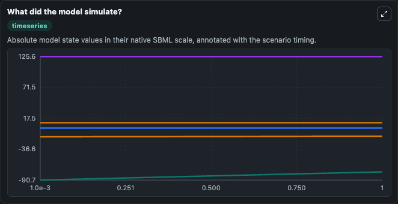
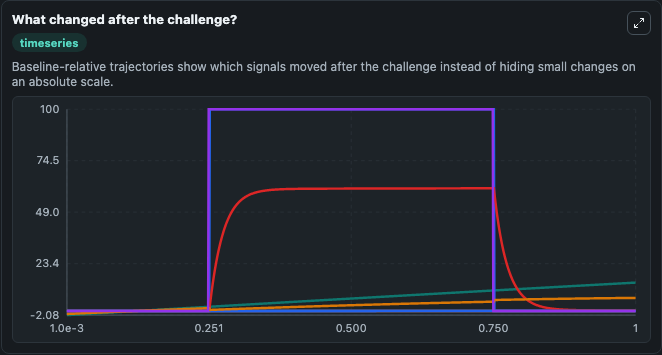
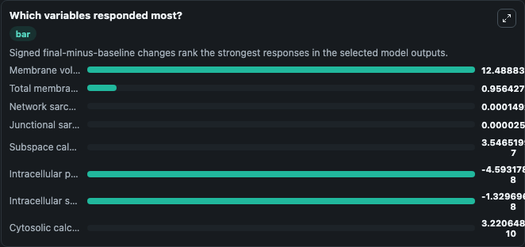
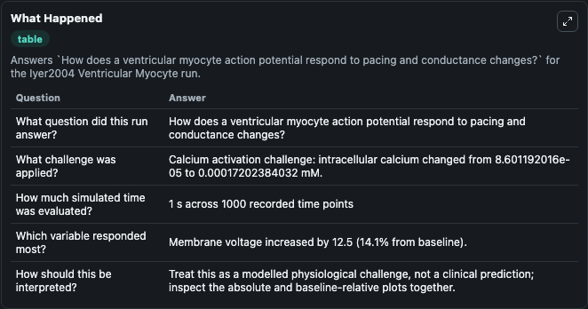

# Iyer2004 Ventricular Myocyte Lab

This lab asks: **How does a ventricular myocyte action potential respond to pacing and conductance changes?**

The lab is composed of two sub-models: a `core` SBML simulator (encoded as SBML, solved by Tellurium) and a dedicated `viz` presenter that turns the raw simulation state into a friendly timeseries plot and a plain-language "What Happened" summary. The split keeps the SBML wrapper clean and makes it easy to swap or extend the visualization without touching the simulator. This a model from the article: A computational model of the human left-ventricular epicardial myocyte. It can be used to explore cardiac dynamics and compare response patterns across conditions.

## What You'll See

The lab opens as a canvas with three model nodes wired in series: the scenario driver on the left, the core simulator in the middle, and the visualization sub-model on the right. After running, the viz node emits four visualizations: an event-annotated absolute timeseries, a baseline-relative response timeseries, a signed response bar chart, and a question-and-answer table titled `What Happened` that answers `How does a ventricular myocyte action potential respond to pacing and conductance changes?` in plain language. The viz node also publishes the table as a structured `run_summary` record that downstream nodes can consume.

**Primary variables shown:** the core publishes a curated state record for the visualization, and the viz node presents these concepts with user-friendly labels:

- Membrane voltage
- Cytosolic calcium
- Intracellular sodium
- Intracellular potassium
- Subspace calcium
- Junctional sarcoplasmic-reticulum calcium
- Network sarcoplasmic-reticulum calcium
- Total membrane current

The captured run applies the configured calcium activation challenge, changing intracellular calcium from `0.00008601192016` to `0.00017202384032` during the challenge window before returning to baseline. It evaluates 1 s of simulated dynamics across Membrane voltage, Cytosolic calcium, Intracellular sodium, Intracellular potassium, and 4 other tracked variables; read the absolute trajectories, baseline-relative plot, response ranking, and summary table together because the variables use different native scales.

<!-- BIOSIMULANT_VISUALS_START -->
### Output Visualizations

The first chart shows the absolute model state trajectories in their native units with the challenge timing included.



The second chart normalizes each trajectory against its baseline so smaller relative shifts are visible beside larger state variables.



The response ranking summarizes final-minus-baseline changes and highlights which selected variables moved most during the configured run.



The summary table restates the lab question, challenge, simulated duration, strongest response, and interpretation limits in plain language.



<!-- BIOSIMULANT_VISUALS_END -->

## How the Models Connect

The canvas has two steps:

1. `iyer2004_ventricular_myocyte_core`: SBML simulator. Receives every contextual input port (ion concentrations, voltages, conductances, etc. — see below), drives roadrunner, and emits two outputs: `state` (per-window species/state-variable record) and `species_labels` (a one-time map of `{species_id: human_label}` lifted from the SBML `<species name=...>` attributes).
2. `iyer2004_ventricular_myocyte_viz`: visualization sub-model. Consumes both `state` and `species_labels` from the core, accumulates the per-window history, prettifies the labels, and renders the two visuals plus the `run_summary` output. No SBML, no roadrunner — pure presentation.

## How to Read the Visualizations

The absolute timeseries plot has one curve per state variable in the SBML model and marks when the challenge and recovery windows begin. The baseline-relative plot rescales each curve against the pre-challenge baseline so small but real responses are visible. The x-axis is simulation time in seconds and the y-axis is the variable's value in its native SBML unit (concentrations in mM or mol, voltages in mV, currents in pA, volumes in mL — refer to the SBML file for the exact unit per variable). Look for periodic patterns (action-potential-style depolarisations, oscillations), monotonic trends, or steady-state plateaus.

The response bar chart ranks final-minus-baseline changes in native SBML units. The "What Happened" table explains the lab question, the applied challenge, the simulated duration, the strongest response, and the interpretation limits.

## What This Lab Contains

- `lab.yaml` declares the two sub-models, runtime, IO, and wiring.
- `wiring-layout.json` places the two nodes on the canvas with the connecting edges.
- `models/core/model.yaml` describes the SBML simulator package.
- `models/core/src/iyer2004_ventricularmyocyte_model0847999575_model.py` is the SBML wrapper (no visualization code).
- `models/core/data/MODEL0847999575.xml` is the original SBML file from BioModels.
- `models/core/tests/` checks instantiation, output accumulation, and output keys.
- `models/viz/model.yaml` describes the visualization sub-model.
- `models/viz/src/iyer2004_ventricular_myocyte_viz.py` consumes core state + labels and renders timeseries, Q&A table, and the `run_summary` record.
- `models/viz/tests/` exercises the viz with synthetic state inputs (no SBML or roadrunner needed).

## Inputs

This lab exposes a set of **contextual scalar ports** specific to its SBML, plus three **generic fallback ports** for everything else.

### Contextual ports (recommended)

These map a human-friendly port name onto a real SBML global parameter. Wire them from upstream nodes or set them in `lab.yaml` `runtime.initial_inputs`. Each scalar override is applied to roadrunner before the next `advance_window` call.

| Input | Meaning | Default | Unit |
|---|---|---|---|
| `temperature` | Sets temperature for the scenario. | 310 | — |
| `extracellular_sodium` | Sets extracellular sodium for the scenario. | 9.798304162 | mM |
| `extracellular_potassium` | Sets extracellular potassium for the scenario. | 125.5589432 | mM |
| `intracellular_calcium` | Sets intracellular calcium for the scenario. | 8.601192016e-05 | mM |
### Generic fallback ports

- `integration_step` (`s`, scalar): override the ODE solver step. Smaller is more precise but slower. Default `0.001`.
- `parameter_overrides` (record, dict of `{parameter_id: value}`): apply override values to any SBML global parameter listed in the **SBML Parameters** table below — useful when you need to override a parameter that has no contextual port. Applied before each window.
- `initial_conditions` (record, dict of `{species_id: value}`): override the starting concentration of any species in the **SBML Species** table below. Applied at setup and on reset.

## Outputs

- `scenario_metadata` (from scenario): scenario name, active challenge input, baseline/challenge/recovery timing, and event markers used by the visualizations.
- `state` (from core): a record of every species and state variable in the SBML model at each communication step. Units are mixed; see the SBML file for per-species units.
- `run_summary` (from viz): structured Q&A record echoing the rows in the "What Happened" table — `{duration_s, point_count, state_variable_count, rows}`. Useful for downstream nodes that want to consume the same plain-language summary the user sees in the visualization.

## Running in Biosimulant Desktop

Import the lab source folder directly:

```bash
biosimulant labs import labs/iyer2004-ventricular-myocyte
```

Then open the imported lab and press Run. The results should include the state-variable timeseries and the `What Happened` Q&A table.

## Notes

- The bundled run uses a baseline plus challenge scenario so the first visualization shows a physiological perturbation without changing the upstream SBML equations.
- Default run length is `1` s with a `0.001` s communication step. These are conservative defaults chosen by category (single-cell electrophysiology vs whole-system circulation vs slow regulatory loop). Tune them in `lab.yaml`.
- Requires `tellurium==2.2.11.2`. The first import compiles the SBML to LLVM in-process.
- License: `CC0` (from upstream BioModels entry [biomodels_ebi:MODEL0847999575](https://www.ebi.ac.uk/biomodels/MODEL0847999575)).
- This wrapper does not modify the upstream biology. To change rates, initial conditions, or kinetic laws, edit the SBML file in `models/core/data/MODEL0847999575.xml` directly.

### Advanced SBML Identifiers

<details>
<summary>Raw upstream identifiers for reproducibility and advanced overrides</summary>

#### SBML Parameters

Full list of global parameter IDs, for use with `parameter_overrides`. Defaults come from the upstream SBML.

| Parameter ID | Name | Default Value |
|---|---|---|
| `a1_COMPUTE_CONCENTRATION_AND_VOLTAGE_DERIVATIVES` | a1 | _(unset)_ |
| `a2_COMPUTE_CONCENTRATION_AND_VOLTAGE_DERIVATIVES` | a2 | _(unset)_ |
| `Faraday` | Faraday | 96.5 |
| `Temp` | Temp | 310 |
| `Rgas` | Rgas | 8.315 |
| `RT_over_F` | RT_over_F | _(unset)_ |
| `Acap` | Acap | 0.0001534 |
| `C` | C | _(unset)_ |
| `Vmyo` | Vmyo | 2.584e-05 |
| `VJSR` | VJSR | 1.6e-07 |
| `VNSR` | VNSR | 2.1e-06 |
| `VSS` | VSS | 1.2e-09 |
| `Nai` | Nai | 9.798304162 |
| `Ki` | Ki | 125.5589432 |
| `Cai` | Cai | 8.601192016e-05 |
| `CaSS` | CaSS | 0.0001420215245 |
| `CaJSR` | CaJSR | 0.2852239446 |
| `CaNSR` | CaNSR | 0.2855294915 |
| `V` | V | -90.65755929 |
| `i_tot` | i_tot | _(unset)_ |
| `Ko` | Ko | 4 |
| `Nao` | Nao | 138 |
| `Cao` | Cao | 2 |
| `i_Stim` | i_Stim | _(unset)_ |
| `stim_period` | stim_period | 1000 |
| `stim_duration` | stim_duration | 3 |
| `stim_amplitude` | stim_amplitude | -15 |
| `stim_offset` | stim_offset | 0 |
| `past` | past | _(unset)_ |
| `fb` | fb | _(unset)_ |
| `Kfb` | Kfb | 0.000168 |
| `Nfb` | Nfb | 1.2 |
| `rb` | rb | _(unset)_ |
| `Krb` | Krb | 3.29 |
| `Nrb` | Nrb | 1 |
| `Jup` | Jup | _(unset)_ |
| `KSR` | KSR | 1.2 |
| `vmaxf` | vmaxf | 7.48e-05 |
| `vmaxr` | vmaxr | 0.000318 |
| `Jrel` | Jrel | _(unset)_ |
| `v1` | v1 | 1.8 |
| `Jtr` | Jtr | _(unset)_ |
| `tautr` | tautr | 0.5747 |
| `Jxfer` | Jxfer | _(unset)_ |
| `tauxfer` | tauxfer | 26.7 |
| `LTRPNtot` | LTRPNtot | 0.07 |
| `HTRPNtot` | HTRPNtot | 0.14 |
| `khtrpn_plus` | khtrpn_plus | 20 |
| `khtrpn_minus` | khtrpn_minus | 6.6e-05 |
| `kltrpn_plus` | kltrpn_plus | 40 |
| _... 444 more, see SBML file_ | | |

#### SBML Species

Full list of species IDs, for use with `initial_conditions`.

_No species declared in this SBML file._

</details>
